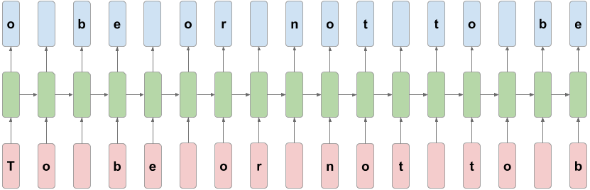

# Character-Level Language Model for the Shakespeare Dataset

A stateful GRU network built with TensorFlow 2 / Keras that learns to predict the next character in Shakespeare's plays and then writes its own text.


## Overview

This project goes through a complete text generation workflow: load raw text, tokenize it at character
level, build inputs and shifted targets, prepare the data for a stateful RNN, train a GRU language model,
read the learning curves and write a sampling algorithm that generates new text from a seed string.

The model reaches **58.1% validation accuracy** predicting the next character (validation loss 1.381, a
perplexity of about 4), and from a seed like `ROMEO:` it writes text that follows the format of a play:
speaker names, verses and mostly real English words.

Everything lives in a single notebook: [`tf2-LM-GRU-shakespeare-text-generation.ipynb`](tf2-LM-GRU-shakespeare-text-generation.ipynb)

## Dataset


A subset of the [Shakespeare dataset](http://shakespeare.mit.edu), a single plain-text file with several
excerpts from different plays concatenated together:

|  |  |
|---|---|
| File | `data/Shakespeare.txt` |
| Size | 1,115,394 characters, 40,000 lines |
| Chunks | 7,886 (the text split at every full stop) |
| Vocabulary | 64 different characters, 66 tokens counting `<UNK>` and the padding id |
| Task | unsupervised next-character prediction |

The text is raw, with no preprocessing: speaker names in capitals, punctuation and line breaks are all
kept. Preprocessing turns every character into an integer id, pads each chunk to 500 tokens and builds the
target as the input shifted one character, so the model predicts the next character at every position.



For the stateful RNN the examples are trimmed to 7,872 and reordered so each batch continues the previous
one, then split into 6,272 sequences for training (196 batches of 32) and 1,600 for validation (50 batches).

## Model

| Layer | Configuration | Output shape | Params |
|-------|---------------|--------------|--------|
| `Embedding` | 66 tokens, 256 dimensions, `mask_zero=True` | (32, None, 256) | 16,896 |
| `GRU` | 1024 units, `stateful=True`, `return_sequences=True` | (32, None, 1024) | 3,938,304 |
| `Dense` | 66 units (logits) | (32, None, 66) | 67,650 |

**4,022,850 trainable parameters** (15.35 MB), about 98% of them in the GRU.

The model is compiled with the Adam optimizer and `SparseCategoricalCrossentropy(from_logits=True)`, and
trained for 15 epochs with batch size 32. A `ModelCheckpoint` keeps only the weights with the lowest
validation loss.

## Workflow

1. **Load** — the text file read into a string and split into chunks at every full stop.
2. **Tokenize** — a character-level Keras `Tokenizer` (case kept, nothing filtered).
3. **Pad** — every sequence padded or truncated to 500 tokens, giving a `(7886, 500)` array.
4. **Inputs and targets** — target sequence = input sequence shifted by one character.
5. **Stateful batching** — arrays trimmed and reordered so each batch continues the previous one, then split 80/20 into training and validation `Dataset` objects.
6. **Train** — GRU language model trained for 15 epochs, saving the best weights.
7. **Learning curves** — training vs validation accuracy and loss, plotted per epoch.
8. **Generate** — model rebuilt with `batch_size=1`, best weights loaded, and a sampling loop that writes 1000 characters from a seed string.

## Results

| Metric | Training (epoch 15) | Validation (best epoch, 7) | Validation (epoch 15) |
|--------|--------------------:|---------------------------:|----------------------:|
| Loss | 0.8725 | **1.3807** | 1.5958 |
| Accuracy | 71.90% | **58.11%** | 56.45% |

The training loss keeps going down for all 15 epochs, but the validation loss reaches its minimum at epoch 7
and rises afterwards, so the model overfits from there. The checkpoint from epoch 7 is the one used to
generate text.

A sample generated from the seed `ROMEO:` (shortened):

```
ROMEO:
Why, here all my celestare at shaken in heaven
Than
Thither, and your penforce you pardon her, he's it to be

CORIOLANUS:
Nay, my Doth french a way to fair daunt,
When he is Liciod, leave mount i' the crawn
A taughter and to make the squellemanage:
```

## Key takeaways

- **The model learns the structure of a play.** With no rules given, it writes speaker names in capitals
  followed by a colon, short verses and blank lines between speakers.
- **It learns words, but not meaning.** Most of the generated words are real English words and it reuses
  names from the training text (*Marcius*, *Tybalt*, *Montague*), but it also invents words (*celestare*,
  *penforce*) and the sentences do not follow a coherent idea.
- **The GRU overfits after epoch 7.** With 4 million parameters it starts memorizing the training text,
  so more epochs would not help. Keeping only the best checkpoint avoided the overfitted weights.
- **58% next-character accuracy is reasonable.** Many characters can be valid in the same place of a
  free text, so exact next-character prediction is a hard task.
- **It handles unseen seeds.** Starting from `DIEGO`, a word that is not in the text, the model still
  continues with the same format.

## Project structure

```
.
├── data/                                         # Shakespeare.txt and the images used in the notebook
├── models/                                       # Best weights (ckpt.weights.h5) and training history (history.json)
├── src/tf2_lm_gru_shakespeare_text_generation/   # Package scaffold
├── tf2-LM-GRU-shakespeare-text-generation.ipynb  # Main notebook
├── pyproject.toml                                # Dependencies (uv project)
└── uv.lock                                       # Pinned versions
```

## Getting started

The project is managed with [uv](https://docs.astral.sh/uv/) and requires Python 3.11+.

```bash
# Clone the repository
git clone https://github.com/ramirezgrosas/tf2-LM-GRU-shakespeare-text-generation.git
cd tf2-LM-GRU-shakespeare-text-generation

# Create the virtual environment and install the dependencies
uv sync
```

Then open the notebook in VS Code and select `.venv` as the kernel, or launch Jupyter directly:

```bash
uv run --with jupyter jupyter lab
```

The text file and the trained weights are already included, so the notebook runs end to end without
training: with `skip_training = True` it loads the saved weights and history from `models/`. Set it to
`False` to train the model again.

Main dependencies: TensorFlow 2.21 (Keras 3), NumPy and Matplotlib.

## Possible improvements

- Add dropout (or recurrent dropout) and `EarlyStopping` to reduce the overfitting.
- Add a temperature to the sampling to control how risky the generated text is.
- Train on more text, or try a bigger or stacked recurrent model (several GRU or LSTM layers).
- Compare the GRU with an LSTM or a Transformer under the same conditions.

## Author

**Diego Ramírez Rosas** — [ramirezgrosas](https://github.com/ramirezgrosas)
